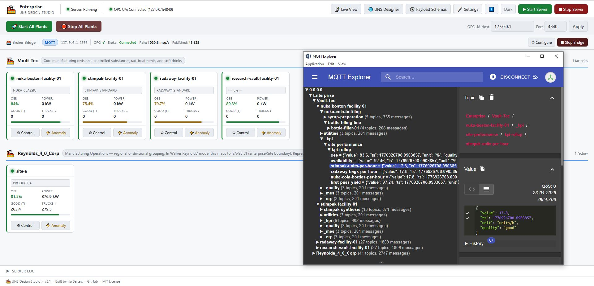
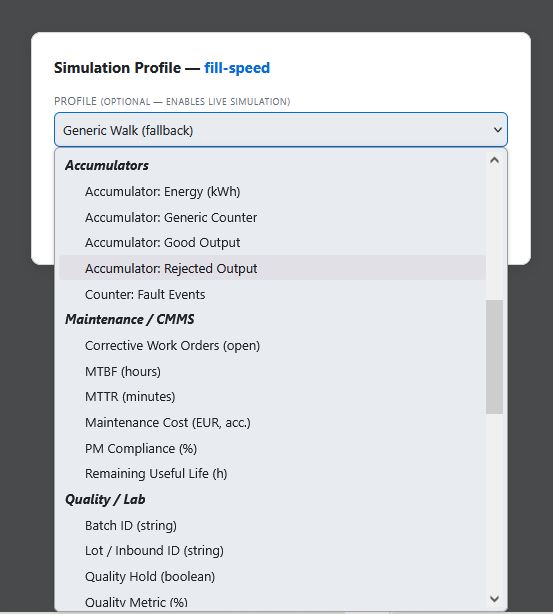
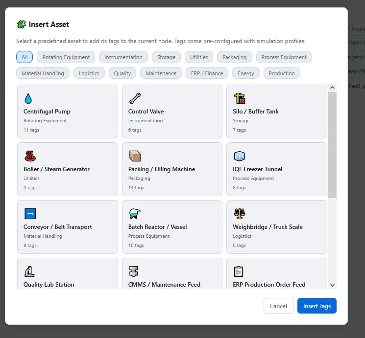
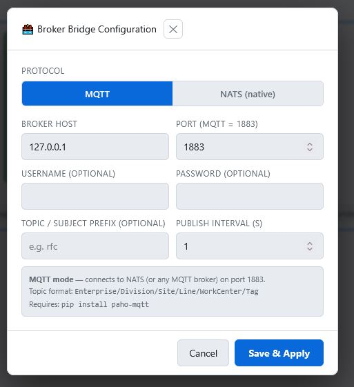
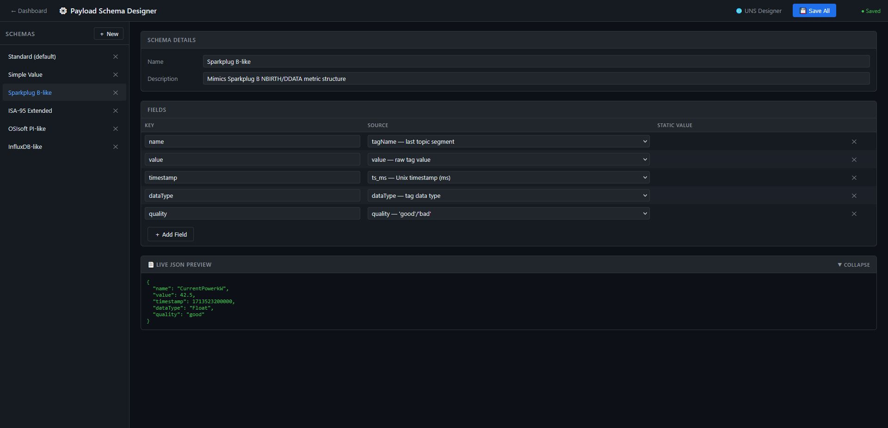
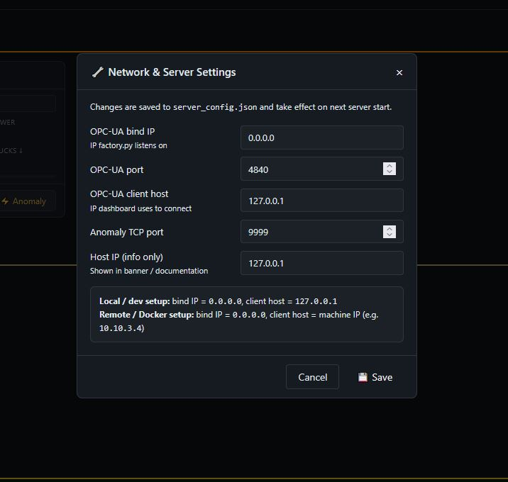
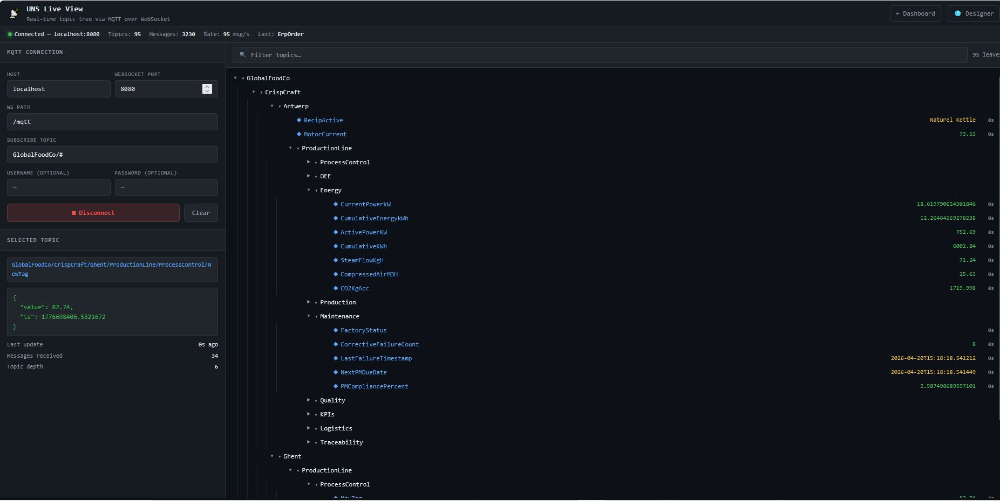

<div align="center">

# UNS Design Studio

**A fully self-contained Unified Namespace simulator for industrial IoT demos, training and development.**

[](LICENSE)
[](docker-compose.yml)
[](https://opcfoundation.org/)
[](https://mqtt.org/)
[](https://nats.io/)
[](https://github.com/Ilja0101)


*Simulate a complete multi-site food manufacturing enterprise — publishing realistic, stateful OT and IT data over OPC-UA, MQTT and NATS — without needing a single piece of real hardware.*

[Quick Start](#-quick-start) · [Dashboard](#-dashboard) · [UNS Designer](#-uns-topic-designer) · [Simulation Engine](#-simulation-engine) · [Recipes](#-recipe-system) · [API Reference](#-api-reference) · [Release Notes](#-release-notes)

</div>

---

## What is this?

The **UNS Design Studio** is a hands-on learning and demo environment for anyone working with **Unified Namespace (UNS)** architecture, **ISA-95 hierarchy**, **OPC-UA**, **MQTT/NATS** and **industrial data modelling**.

It ships with a fictional five-division food manufacturer — 13 factories across Europe — all producing coherent, realistic process data driven by a proper plant state machine. No random noise. No hardcoded tags. Everything is configurable through a visual browser-based designer.

**Built for:**
- Engineers learning UNS and ISA-95 concepts hands-on
- Teams evaluating MQTT brokers, NATS or time-series databases
- Demonstrating IIoT architecture to stakeholders without real equipment
- Testing Grafana dashboards, Telegraf pipelines or digital twin tooling

---

## Features at a Glance

| Feature | Description |
|---|---|
|  **Stateful simulation** | Per-plant state machine: Running → Fault → Recovery → Stopped |
|  **44 simulation profiles** | OEE, process variables, CMMS, quality, logistics, ERP, energy, recipes |
|  **Asset library** | 16 predefined asset bundles — drop onto any UNS node in one click |
|  **UNS Topic Designer** | Visual ISA-95 hierarchy editor in the browser |
|  **Recipe system** | Per-plant recipe lists — switching recipes shifts simulation parameters live |
|  **MQTT + NATS bridge** | Configurable payload schemas, topic prefixes and publish intervals |
|  **Payload Schema Designer** | Design your own message formats — Sparkplug B, ISA-95, PI, InfluxDB and more |
|  **Docker-first** | Single `docker compose up` gets everything running |

---

##  Quick Start

### Prerequisites
- [Docker](https://docs.docker.com/get-docker/) with Docker Compose
- Ports **5000** (dashboard), **4840** (OPC-UA) and **9999** (anomaly TCP) available

- OR, simply start the .BAT file in the app folder and point the app at an (MQTT / NATS) broker or other data consumer!

```bash
git clone https://github.com/Ilja0101/UNS-Design-Studio.git
cd UNS-Design-Studio
docker build -t uns-design-studio:latest .
docker compose up -d
```

Open **http://localhost:5000** fire up the virtual plants and start streaming data!.

---

##  Dashboard



The main dashboard gives you a live overview of every factory across all divisions. Each plant card shows:
- Running / Fault / Stopped status with colour-coded LED indicator
- Current OEE and power draw
- Active recipe name
- Good output tonnage and truck deliveries

The **Broker Bridge** bar at the top shows protocol, broker address, connection state and live publish rate. In the screenshot above the bridge is publishing at **956 msg/s** with **1,577 messages** delivered, and MQTT Explorer on the right shows the full ISA-95 topic tree with live values flowing.

### Plant Control

Click **Control** on any factory card to open the control panel:


From here you can toggle the plant between Running and Stopped, and select the active recipe from the configured list. Changes take effect on the next simulation tick (~1.2 seconds).

---

##  UNS Topic Designer

Navigate to **http://localhost:5000/uns** to open the visual namespace editor.


The left panel shows your full ISA-95 hierarchy. Click any node to edit its properties — name, type, description — and see the full MQTT/NATS topic path update live. Node types follow the ISA-95 levels: Enterprise → Business Unit → Site → Area → Work Center → Work Unit → Device.

### Tags / Data Points

Select a node and click the **Tags** tab to manage its data points:


Each tag has a name, data type, unit, access level, payload schema and simulation profile. The simulation profile column shows the assigned profile in green and is clickable to change it. The tag table scrolls — a production line node can carry dozens of tags covering OEE, energy, production, maintenance, quality, logistics, traceability and finance in a single view.

### Assigning Simulation Profiles

Click the pencil icon on any simulation profile cell to open the profile editor:



Profiles are grouped by domain in an `<optgroup>` dropdown — OT / Process, Accumulators, Maintenance / CMMS, Quality / Lab, Logistics, ERP / Finance, Energy / Utilities, Recipe and Other. Each profile shows a contextual hint explaining its behaviour when selected.

The **Active Recipe** profile is in its own **Recipe** group at the bottom of the list:


Any tag with the `recipe` profile will publish the name of the currently active recipe as a string — flowing through to MQTT/NATS like any other tag. Set the tag data type to **String** as shown.

---

##  Asset Library

The fastest way to populate a node with a realistic, pre-wired set of tags is the **Insert Asset Bundle** button:



Filter by category (Rotating Equipment, Instrumentation, Storage, Utilities, Packaging, Process Equipment, Material Handling, Logistics, Quality, Maintenance, ERP/Finance, Energy, Production), click a card to select it, then click **Insert Tags**. The full bundle drops in with simulation profiles, data types and units already configured.

Available assets include:

| Asset | Tags | Category |
|---|---|---|
| Centrifugal Pump | 11 | Rotating Equipment |
| Control Valve | 6 | Instrumentation |
| Silo / Buffer Tank | 7 | Storage |
| Boiler / Steam Generator | 9 | Utilities |
| Packing / Filling Machine | 13 | Packaging |
| IQF Freezer Tunnel | 8 | Process Equipment |
| Conveyor / Belt Transport | 8 | Material Handling |
| Batch Reactor / Vessel | 10 | Process Equipment |
| Weighbridge / Truck Scale | 5 | Logistics |
| Quality Lab Station | 7 | Quality |
| CMMS / Maintenance Feed | 7 | Maintenance |
| ERP Production Order Feed | 7 | ERP / Finance |
| Energy / Utility Meter | 5 | Energy |
| Fryer / Pre-Fryer | 9 | Process Equipment |
| Drum Dryer | 9 | Process Equipment |
| Crystallizer / Evaporator | 8 | Process Equipment |

---

##  Recipe System

Recipes are configured per plant in the **Recipes** tab — visible when a **Site** node is selected:


Each recipe in the list has a name and optional simulation parameters. The currently active recipe is marked with a green **● active** badge. Click **＋ Add Recipe** to add new ones, click the × to remove. Changes save to `sim_state.json` immediately via the API.

When a recipe is selected in the dashboard Control panel, `factory.py` picks it up on the next tick and adjusts its base simulation parameters — power draw, infeed rate, quality targets and availability targets — to match the recipe definition. So switching from *Naturel Kettle* to *Paprika Crunch* at a CrispCraft factory actually changes the numbers, not just the label.

Any tag with the `recipe` simulation profile publishes the active recipe name as a string topic:


---

##  Broker Bridge

Click **Configure** in the bridge bar to open the broker configuration:



Switch between **MQTT** (port 1883) and **NATS native** (port 4222) with the toggle. Set broker host, port, optional credentials, topic/subject prefix and publish interval. The note at the bottom updates live to show the exact topic format that will be used based on your settings.

---

##  Payload Schema Designer

Navigate to **http://localhost:5000/payload-schemas** to design your message formats:



Each schema defines a set of key-value mappings from source fields (value, timestamp, quality, unit, tag path, site name, data type) to output JSON keys. The **Live JSON Preview** at the bottom shows exactly what a published message will look like. Built-in schemas include Standard, Simple Value, Sparkplug B-like, ISA-95 Extended, OSIsoft PI-like and InfluxDB-like. Add as many custom schemas as you need.

Per-tag payload schema assignment is done in the Tags tab of the UNS designer — each tag can use a different schema.

---

##  Network & Server Settings

Click the **Settings** button in the dashboard header:



Configure the OPC-UA bind IP, port, client host and anomaly TCP port. Changes are saved to `server_config.json` and take effect on next server start. For remote or Docker setups, set the client host to your machine's LAN IP so other OPC-UA clients on the network can connect.

---

##  Simulation Engine

Each factory runs an independent `PlantState` state machine:

```
                    ┌──────────────────────────────────┐
                    ▼                                  │
  ┌─────────┐   fault    ┌───────┐   repaired   ┌──────────┐
  │ Running │───────────►│ Fault │─────────────►│ Recovery │
  └─────────┘            └───────┘              └──────────┘
       ▲                                              │
       └──────────────────── ready ───────────────────┘

  ┌─────────┐   start command
  │ Stopped │────────────────────────────────────────► Recovery
  └─────────┘
```

Every tag derives its value from the assigned **simulation profile** and the plant's current state — no tag names are hardcoded anywhere. When a fault fires:

- Availability collapses; OEE follows (always `A × P × Q / 10000`)
- Flow rate and speed drop to zero
- Motor current spikes; vibration rises
- Power drops to ~12% (standby only)
- All accumulators pause

**Recipe switching** adjusts `_base_power`, `_infeed_rate`, `_qual_target` and `_avail_target` on the next tick. A FrostLine Steakhouse 14mm run draws more power and targets higher quality than Classic Frites 10mm — immediately reflected in all downstream tag values.

Per-division base parameters ensure a FrostLine frozen frites plant (820 kW, 28 t/h) behaves differently from a SugarWorks beet plant (1185 kW, 95 t/h) without any configuration.

---

##  The Example Enterprise

The simulator ships with **GlobalFoodCo** — rename it to anything in the UNS designer, the dashboard and topic paths update automatically.

| Division | Product | Factories |
|---|---|---|
|  **CrispCraft** | Chips & Snacks | Antwerp, Ghent |
|  **FlakeMill** | Potato Flakes | Leiden, Groningen |
|  **FrostLine** | Frozen Frites | Dortmund, Bremen, Hanover, Leipzig, Cologne, Dresden |
|  **RootCore** | Chicory & Inulin | Lille |
|  **SugarWorks** | Sugar Beet & Sugar | Bruges, Liege |

> All names, divisions and locations are entirely fictional.

---

##  Project Structure

```
UNS-Design-Studio/
├── factory.py            # OPC-UA server + stateful simulation engine
├── bridge.py             # OPC-UA → MQTT / NATS bridge
├── app.py                # Flask web application + REST API
├── recipe.py             # Legacy recipe definitions (reference only)
├── client.py             # Optional CLI client for direct OPC-UA access
│
├── uns_config.json       # ISA-95 namespace definition (editable via UI)
├── sim_state.json        # Runtime plant state, active recipes and recipe lists
├── asset_library.json    # Predefined asset tag bundles
├── payload_schemas.json  # MQTT/NATS payload format definitions
├── bridge_config.json    # Bridge connection settings
├── server_config.json    # OPC-UA server endpoint configuration
│
├── templates/
│   ├── index.html            # Main dashboard
│   ├── uns_editor.html       # UNS Topic Designer
│   └── payload_schemas.html  # Payload Schema Designer
│
├── docs/                 # Screenshot images for this README
├── Dockerfile
├── docker-compose.yml
├── entrypoint.sh         # First-boot config seeding + symlinks
└── requirements.txt
```

##  Live UNS viewer (requires external broker + Websocket)



---

##  Configuration Reference

### `server_config.json`
```json
{
  "opc_bind_ip":     "0.0.0.0",
  "opc_port":        4840,
  "opc_client_host": "127.0.0.1",
  "tcp_port":        9999,
  "host_ip":         "127.0.0.1"
}
```
> Set `host_ip` to your Docker host's LAN IP to allow OPC-UA clients on other machines to connect.

### `bridge_config.json`
```json
{
  "protocol":     "mqtt",
  "broker_host":  "127.0.0.1",
  "broker_port":  1883,
  "topic_prefix": "",
  "interval":     2
}
```
> Set `protocol` to `"nats"` and `broker_port` to `4222` for NATS native mode.

### Persistent volume
On first boot, `entrypoint.sh` seeds all JSON config files into the `uns-data` Docker volume. Subsequent container rebuilds do not overwrite your customised namespace or schemas.

---

##  Running Without Docker

```bash
pip install -r requirements.txt

# Run BAT file to start .py processes
start_dashboard.bat
```

Dashboard: `http://localhost:5000`

---

##  API Reference

| Method | Endpoint | Description |
|---|---|---|
| `GET` | `/api/status` | Server status, plant states, bridge stats, enterprise name |
| `GET` | `/api/uns` | Current UNS namespace configuration |
| `POST` | `/api/uns` | Save UNS config (triggers factory restart) |
| `GET` | `/api/asset-library` | Full asset template library |
| `GET` | `/api/simulation-profiles` | Grouped simulation profile catalogue |
| `GET` | `/api/payload-schemas` | Payload schema definitions |
| `POST` | `/api/payload-schemas` | Save payload schemas |
| `POST` | `/api/server/start` | Start OPC-UA factory server |
| `POST` | `/api/server/stop` | Stop OPC-UA factory server |
| `POST` | `/api/bridge/start` | Start MQTT/NATS bridge |
| `POST` | `/api/bridge/stop` | Stop bridge |
| `GET` | `/api/bridge/config` | Get bridge configuration |
| `POST` | `/api/bridge/config` | Save bridge configuration |
| `POST` | `/api/plant/start` | Start a specific plant |
| `POST` | `/api/plant/stop` | Stop a specific plant |
| `GET` | `/api/recipes/<group>/<plant>` | Get recipe list and active recipe for a plant |
| `POST` | `/api/recipes/<group>/<plant>` | Save recipe list for a plant |
| `GET` | `/api/opc/test` | Diagnose OPC-UA connectivity |

---

##  Release Notes

### v3.0 — Stateful Profile Engine *(current)*
- **Complete rewrite of the simulation engine** — coherent per-plant state machine replacing independent random walks
- **44 simulation profiles** — all plant-state-aware, spanning OT, CMMS, quality, logistics, ERP, energy and recipes
- **Recipe system** — per-plant recipe lists in `sim_state.json`; switching recipes adjusts simulation parameters live
- **`recipe` simulation profile** — any tag assigned this profile publishes the active recipe name as a string
- **16-asset library** — predefined bundles insertable from the UNS designer in one click
- **Dynamic enterprise name** — dashboard reads UNS tree root name live
- **Grouped simulation profile picker** with contextual hints per profile
- **Recipes tab** in the UNS designer on Site nodes
- **New API endpoints** — `/api/asset-library`, `/api/simulation-profiles`, `/api/recipes/<group>/<plant>`
- **OEE always `A × P × Q / 10000`** — never independently randomised
- **Accumulators gate on plant state** — pause during fault and stop
- **Silo auto-refill** on simulated truck arrival
- **Finance accumulators** track coherently from output rates
- **Backward compatible** — existing profile names continue to work

### v2.0 — Dynamic Address Space
- `uns_config.json`-driven OPC-UA address space — no hardcoded tag names
- Visual UNS Topic Designer with full ISA-95 node type support
- Payload Schema Designer with Standard, Sparkplug B-like, ISA-95 Extended, PI-like and InfluxDB-like presets
- Canonical tag inheritance across plants in a division
- Per-plant start/stop via `sim_state.json`
- NATS native mode in the bridge
- Anomaly injection via TCP socket

### v1.0 — Initial Release
- OPC-UA server with static address space
- MQTT bridge with configurable polling interval
- Flask dashboard with factory status overview
- Basic Gaussian walk simulation
- Docker support

---

##  Contributing

1. Fork the repo and create a feature branch: `git checkout -b feature/my-improvement`
2. Commit: `git commit -m 'Add XYZ'`
3. Push and open a pull request

**Adding a simulation profile:** add to both `_profile_value()` in `factory.py` and the `SIMULATION_PROFILES` dict in `app.py` — the latter populates the UNS designer dropdown.

**Adding an asset template:** add an entry to `asset_library.json` — it appears in the picker immediately on next page load.

---

## 📄 License

MIT — see [LICENSE](LICENSE) for details.

---

<div align="center">

*GlobalFoodCo and all associated divisions, factories and products are entirely fictional.*<br>
*Built with ☕ to make UNS concepts tangible for engineers who learn by doing.*<br><br>
**[⭐ Star on GitHub](https://github.com/Ilja0101/UNS-Design-Studio)** · **[👤 Ilja Bartels](https://github.com/Ilja0101)**

[](https://ko-fi.com/F1F11Y5F5R)

</div>
